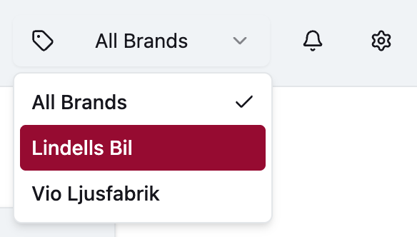

# Test project for new developers

## Tech stack

- [React](https://reactjs.org/)
- [React Router v7 Framework](https://reactrouter.com/start/modes) (formerly [Remix](https://v2.remix.run/docs/start/quickstart))
- [Supabase](https://supabase.com/)
- [shadcn/ui](https://ui.shadcn.com/) (= [Tailwind](https://tailwindcss.com/) + [Radix UI](https://www.radix-ui.com/))
- [TypeScript](https://www.typescriptlang.org/)
- [Vite](https://vite.dev/)

## Setting up

1. Fork this repo (see the gray `Fork` button on GitHub)
2. Clone your new repo to your computer (see the green `<> Code` button on GitHub)
3. [Start Docker](https://www.docker.com/) (used for Supabase)
4. Start Supabase: `npx supabase start` (tip: you can run the [Supabase web dashboard](http://localhost:54363/project/default/editor))
5. Take note of `Publishable key/anon key` when starting Supabase. Use `npx supabase status` if you didn’t get this already
6. Copy `.env.example` to `.env` and update `SUPABASE_ANON_KEY` from step 4
7. Reset/seed the database: `npx supabase db reset`
8. Install NPM packages: `npm install`

## Running

Run the app with:

    npm run dev

Go to http://localhost:5173/ and log in with:

- Email: `dev@blendalabs.com`
- Password: `video`

## Development workflow

We normally use [Linear](https://linear.app/) for issue tracking and creating branch names, but ignore this for now.

1. Fork this repo (see the gray `Fork` button on GitHub).
2. Create new branch for the new feature/fix: `[username]/[description-of-feature]` (PR title: “Description of feature”).
3. Write your amazing code.
4. Apply code linting/prettifier (`npm run fix`) before committing code and correct any issues.
5. Create a new [pull request (PR)](https://github.com/blendalabs/test-reactrouter-supabase/pulls) on GitHub.
6. Tech Lead will review your pull request.

P.S. It’s ok to merge `main` branch into your own feature branch to solve conflicts.

### Creating migrations for database changes

- Create empty, time-stamped migration file with: `npx supabase migration new [migration-name]`
- Reset local database, test migrations and seeding (`npx supabase db reset`)

### Code style guide

- Aim for 1) readability, then 2) minimalism/DRY:ness: _“Code is read more than it is written”_.
- Use `React.FC` for components.
- Use a TypeScript `interface` called `...Props` for complex function arguments, e.g: `const CategoryCard: React.FC<CategoryCardProps>`
- Event handlers starts with `handle`, props with `on`: `onPress={handlePressButton}`.
- Organise your `import`s in groups: external imports, business logic, components, assets.
- Define global TypeScript types including “shortcuts” to Supabase types in `global.d.ts`.

### How to build a typical CRUD view in React Router v7 Framework

- Make a Supabase/Postgres SQL view with all columns you need, e.g. `view_categories`
- Create a file for your page/route (e.g. `app/routes/my-page.tsx`) with this structure:
	1. Load data: `loader` (React Router v7 Framework)
	2. Render: `export default function MyPageName` (React component).
	3. Form interactions: `action` (React Router v7 Framework)

## Test tasks

### Test task 1: Brand selector

We want to be able to filter Video Templates based on Brand, e.g. `?brand=vio-ljusfabrik`:

Notes:
- This requires database migrations, backend code, and frontend code.
- We don’t need an UI to create new brands, but example data in database seed.
- React Router v7 Framework contains helpers for URL parameters.

Submit your code as a [PR](#development-workflow). Good luck!
